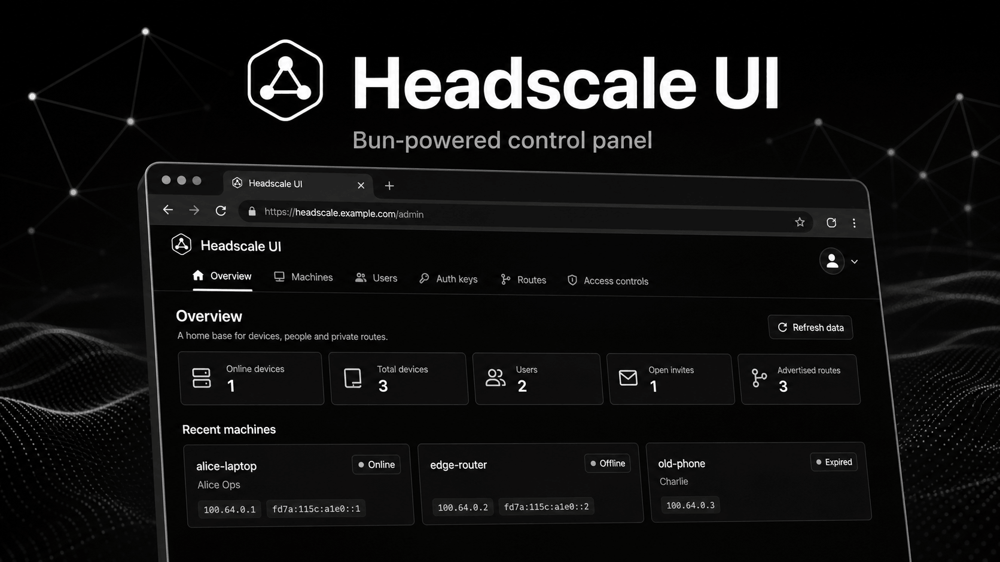

# Headscale UI



A Bun-powered Headscale administration interface for operating a private
tailnet without making users think in raw API endpoints or policy JSON.

Headscale UI is built around the daily admin workflow: save multiple server
profiles, connect to a Headscale instance, review machines and users, create
auth keys, approve routes, and design access policy through guided controls.

> This project is an independent UI for Headscale. It is not an official
> Headscale, Tailscale, or WireGuard product.

## Features

- Multi-profile login: save, switch, and delete multiple Headscale server
  profiles from the browser.
- Compact product shell: logo, tab menu, and profile menu stay in a single
  focused header.
- Machines table: search, status filtering, IP tags, route tags, owner details,
  and row-level actions.
- Users table: user filters, device lists, auth source display, and user
  management actions.
- Auth key flow: reusable and ephemeral keys, ACL tags, expiration picker with
  date and time, and generated `tailscale up` commands.
- Route review: subnet and exit-route approval with clear risk signals.
- Access control designer: rules, groups, and tag ownership are edited through
  menus and form controls instead of raw JSON.
- Internationalization with `vue-i18n`: English by default, plus Chinese,
  French, Russian, Spanish, and Arabic with RTL document direction.
- Theme support: light, dark, and system modes.
- Mock mode for local development and real mode for a Headscale API server.

## Tech Stack

- Runtime and package manager: Bun only
- App framework: Vue, Vue Router, TypeScript, Vite
- UI: shadcn-vue style components, Reka UI primitives, Tailwind CSS, Lucide
  icons
- HTTP: Axios
- i18n: vue-i18n
- Test runner: Bun test and Vitest Browser with WebDriverIO for E2E coverage
- Formatting and linting: Biome

## Quick Start

Install dependencies with Bun:

```bash
bun install
```

Start the local dev server:

```bash
bun run dev
```

Open the printed local URL, then use the default mock profile to explore the
UI without a live Headscale server.

To connect to a real server, create or select a profile, choose `Real`, enter
the server URL and an API key created by Headscale, then connect.

## Scripts

```bash
bun run dev       # Start Vite dev server
bun run build     # Type-check and build production assets
bun run lint      # Run Biome checks
bun run test      # Run Bun unit tests
bun run test:e2e  # Run Vitest Browser E2E tests
bun run check     # Lint, unit test, build, and E2E
```

The project intentionally avoids Node.js scripts. Use Bun for installation,
development, tests, builds, and deployment commands.

## Deployment

The app is a static SPA and can be deployed to Cloudflare Pages.

Recommended Cloudflare Pages settings:

- Build command: `bun install --frozen-lockfile && bun run build`
- Build output directory: `dist`
- Environment variable: `BUN_VERSION=1.3.13`

The repository includes `public/_redirects` so deep profile URLs are served by
`index.html`:

```text
/* /index.html 200
```

Live deployment:

- https://headscale.lyz.cloud

## Project Layout

```text
src/
  api/          Headscale REST client, mock client, payload helpers
  components/   Product components and shadcn-vue style UI primitives
  domain/       Headscale operation metadata and node status logic
  i18n/         Locale metadata and translated messages
  router/       SPA routes for login and profile sections
  views/        Main dashboard surface
e2e/            Vitest Browser E2E scenarios
public/         Static deployment files
docs/assets/    README and documentation images
```

## Development Notes

- The login screen stores profiles in browser `localStorage`; signing out
  stops the active health polling lifecycle.
- Mock mode is backed by `MockHeadscaleClient`, which provides deterministic
  users, machines, routes, auth keys, health, version, and policy data.
- Real mode uses the REST client boundary in `src/api/headscale-client.ts`.
- Access policy editing preserves advanced policy sections while exposing the
  main ACL, group, and tag-owner workflow through friendly UI controls.
- Arabic support sets `document.dir = "rtl"` through the locale metadata.

## Verification

Before shipping a change, run:

```bash
bun run check
```

This covers Biome, Bun unit tests, TypeScript production build, and Vitest
Browser E2E tests.
